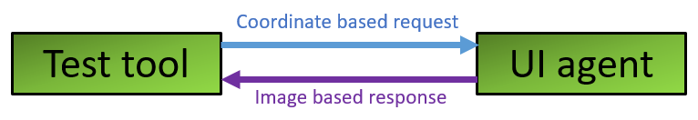
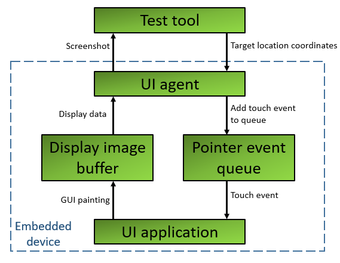
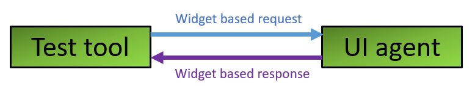
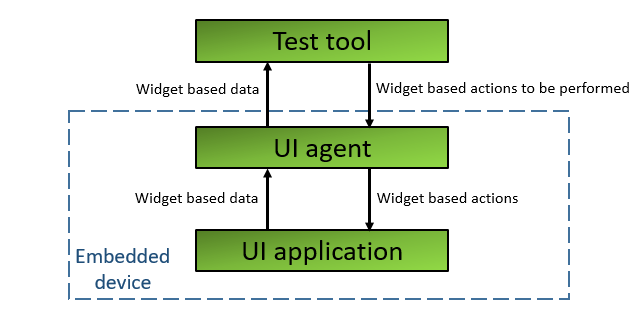
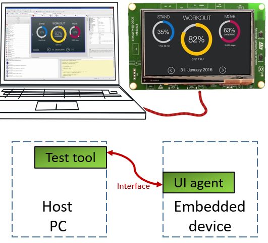

# Choosing a framework for Automated testing of Embedded GUI

This article introduces the typical setup of an Embedded GUI's Automated test framework.

This will help us evaluate and choose a suitable test framework.

# Framework model

The test framework can be viewed as a client-server model.

In this test framework, the *client* would be the *Test tool* that makes requests. The *server* would be the *UI agent* that consumes the request and sends the response.

# Request

Requests are sent by the test tool to the UI agent.

The requests are intended for below purposes:

- Perform an action on the user interface -  
  This request informs the UI about the action to be taken. This request eliminates the manual effort involved in performing an operation on the UI.

- Collect data from the user interface -  
  This request informs the UI about the data to be revealed. This request eliminates the manual effort involved in viewing the UI to collect relevant data.

The requests can be of two types:

- Coordinate based -  
  The requests have a coordinate embedded in them. The request informs the UI to perform a click event at the requested coordinate.

- Widget based -  
  The requests have a widget identifier and an associated action embedded in them. The request informs the UI to perform the action on the widget.

# Response

Responses are sent by the UI agent to the test tool.  
The responses are used by the test tool to validate the tests.

Responses can be of two types:

- Image based -  
  The GUI is revealed by accessing the display image buffer and capturing a screenshot. This screenshot is shared as the response.

- Widget based -  
  The information about the widget’s visibility, state, properties, etc. is collected. This information is shared as the response.

# Testing techniques

Testing techniques are differentiated based on the test validation methodology employed by the test tool.

The testing techniques can be classified into two categories:

- **Image based** -

  This technique is a combination of coordinate-based request & image-based response.
  
  

  Workflow -

  1. The test tool sends coordinate-based requests to the UI agent.

  2. The UI agent performs click events at the requested coordinates.

  3. The test tool sends a data collection request to the UI agent.

  4. The UI agent sends a screenshot as an image-based response.

  5. The test tool validates the test using the screenshot in the response by employing image comparison, object recognition, text recognition, etc.

  
  
  Pros -

  1. Independent from underlying GUI framework: The click events are simulated at OS level. Screenshots of the GUI are used for validation. Thus, underlying GUI framework becomes irrelevant.

  2. Close to manual testing in terms of accuracy: The test tool sees what the manual tester would see, and the test tool uses image comparison for validation. Thus, it is closer to manual testing in terms of accuracy.

  3. Easy to learn: Image based tools are easy to pick up. Experience in the application’s programming language isn’t required.

  Cons -

  1. Sensitive to changes: Since image comparison is employed, when there is a change in the screen content, there is a chance the tests would fail.

  2. Rework: When there is a change to the screen layout, it might require changes to the test cases.

  3. Migration risk: If the application were to be migrated from desktop to mobile, it would require re-creating all the test cases.

- **Widget based** -

  This technique is a combination of widget-based request & widget-based response.
  
  

  Workflow -

  1. The test tool sends widget-based requests to the UI agent.

  2. The UI agent performs requested actions on the widgets.

  3. The test tool sends a data collection request to the UI agent.

  4. The UI agent sends a widget-based response.

  5. The test tool validates the test using the widget’s information from the response.

  
  
  Pros -

  1. In-depth testing: The coupling with the application helps to perform a deeper level of testing.

  2. Robust: Since the requests and responses are widget based, the tests aren’t prone to be impacted by screen layout changes.

  Cons -

  1. Insensitive to screen layout: Since validation is done solely based on widget data, issues with the layout of these widgets will not be detected.

  2. Upgrade risk: Tight coupling with UI framework implies that issues might crop up during software upgradation.

# Test environment

Below is the typical test environment:

- The UI agent is located on the embedded device.

- The test tool is located on a host PC.

- The test tool and the UI agent communicate with each other via an interface of the embedded device.

When the test’s execution and verification is simple and straight forward, the test tool can be in the embedded device. When the test’s execution and verification involve image processing or other activities which cannot be performed on an embedded device, the test tool is located on a host PC.

If the GUI framework allows the UI to run as a standalone program on a host PC, the testing could be performed on this standalone version of the UI and thereby eliminating any dependencies or complexities of the embedded device. The downside of this test environment is that, due to the powerful hardware on the PC, the responsiveness does not match that of the actual UI.

# Conclusion

When a program’s GUI is being evaluated for automated testing, a feasibility study must be carried out for both the testing techniques. This will reveal the capabilities and limitations of the GUI.

The program’s current and future state should be kept in mind while evaluating the pros and cons of the testing techniques.

The limitations revealed from the feasibility study, and the weightage of pros and cons of testing techniques will help in deciding the testing technique to be adopted.

Once the testing technique is finalized, multiple tools and libraries must be evaluated to understand their benefits and limitations.

This evaluation exercise will help zero down on the most suitable test framework.
